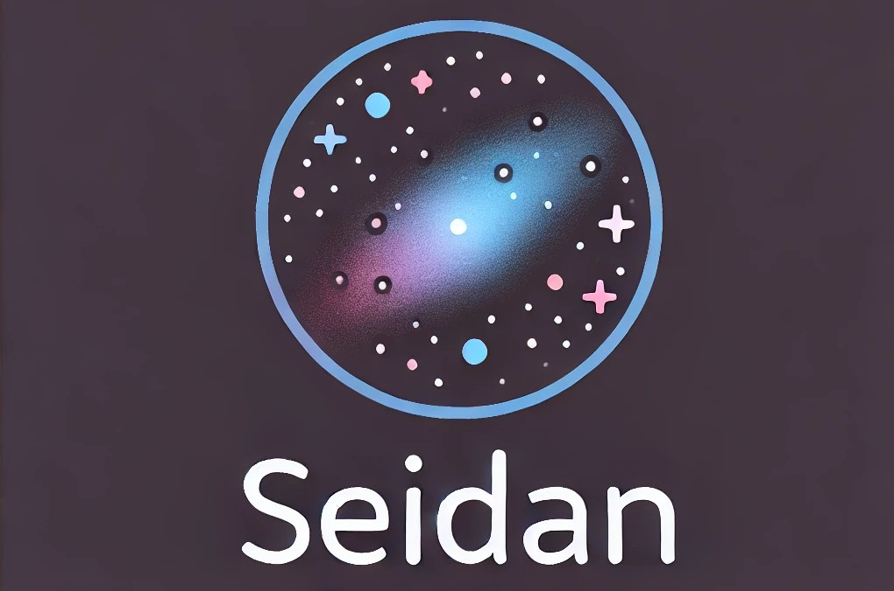

<p align="center">
  <br>
  <a href="https://github.com/Wolfsion/Se1dan">
    
  </a>
  <br>
</p>
  <p align="center">
    <a href="#">技术选型</a> •
    <a href="#">配置</a> •
    <a href="#">调试</a> •
    <a href="#">部署</a>
  </p>
<p align="center">
  
  
  
  
</p>

## 主要技术栈
Spring Boot2.7 + MyBatisPlus + Redisson + COS + Zhipu AI

## 必须修改的配置
application.yml文件同级创建application-prod.yml，配置以下信息：
+ MySQL服务地址
+ Redis服务地址
+ COS 腾讯云对象存储密钥
+ Zhipu AI密钥

## 调试文档地址
默认: http://localhost:8101/api/doc.html

## 容器部署
1. 应用后台打包(2选1即可)，构建docker镜像
    ```shell
    # 容器中打包
    docker build -t se1dan .
    
    # 本地打包拷贝
    docker build -f Dockerfile-quick -t se1dan .
    ```

2. 启动容器
    ```shell
    docker run --name seidan -d -p 8080:8101 se1dan8080